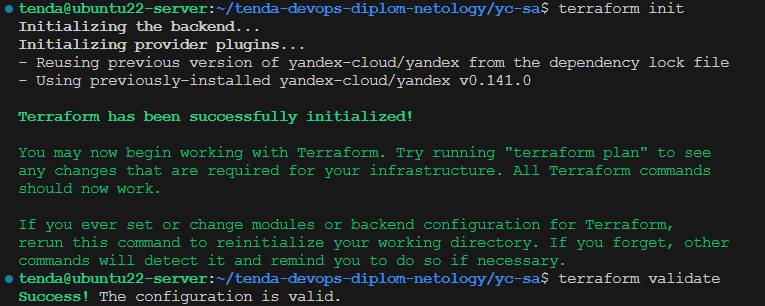
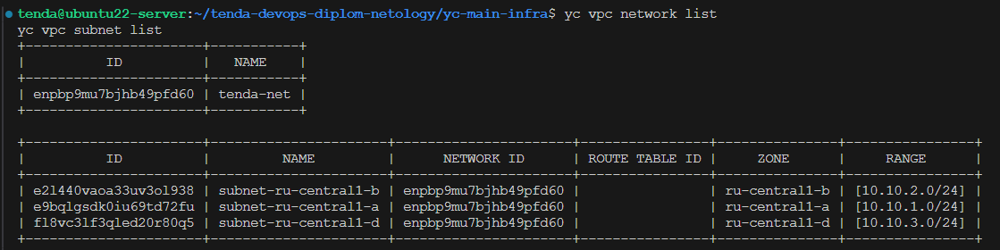
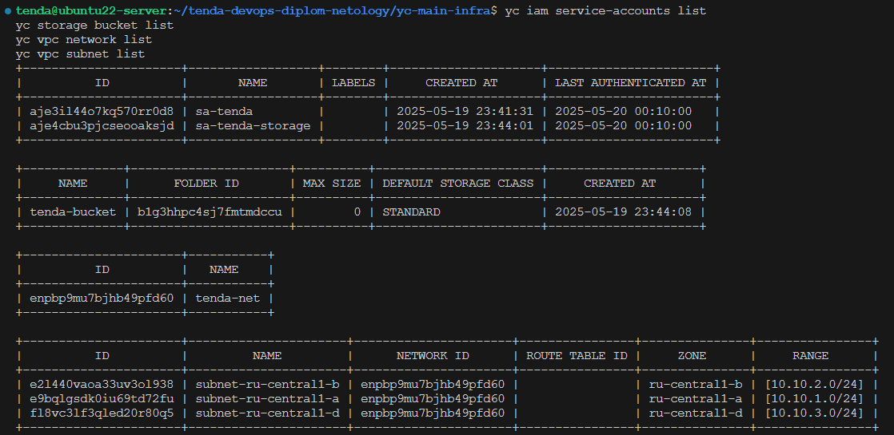
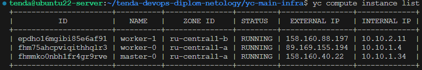
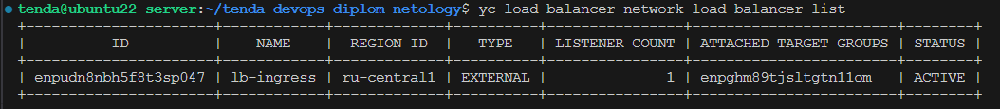
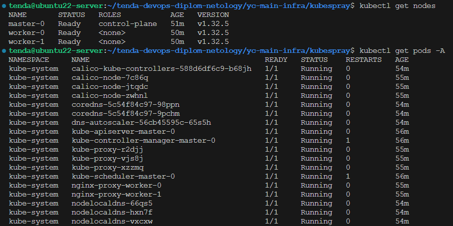
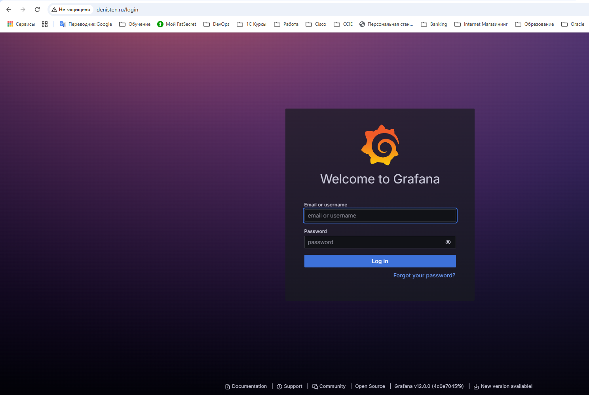
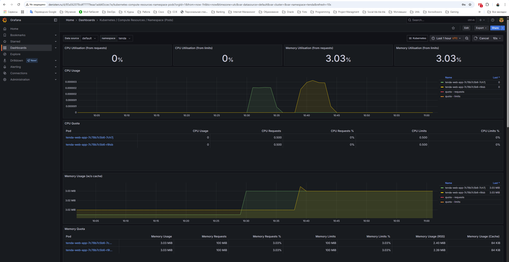

# Дипломный практикум в Yandex.Cloud

## Автор: Тен Денис Александрович
## Группа: FOPS-20

  * [Цели:](#цели)
  * [Этапы выполнения:](#этапы-выполнения)
     * [Создание облачной инфраструктуры](#этап-1-создание-облачной-инфраструктуры)
     * [Создание Kubernetes кластера](#этап-2-создание-kubernetes-кластера)
     * [Создание тестового приложения](#этап-3-создание-тестового-приложения)
     * [Подготовка cистемы мониторинга и деплой приложения](#этап-4--подготовка-cистемы-мониторинга-и-деплой-приложения)
     * [Установка и настройка CI/CD](#этап-5-установка-и-настройка-cicd)
  * [Что необходимо для сдачи задания?](#что-необходимо-для-сдачи-задания)
  * [Как правильно задавать вопросы дипломному руководителю?](#как-правильно-задавать-вопросы-дипломному-руководителю)

**Перед началом работы над дипломным заданием изучите [Инструкция по экономии облачных ресурсов](https://github.com/netology-code/devops-materials/blob/master/cloudwork.MD).**

---
## Цели:

1. Подготовить облачную инфраструктуру на базе облачного провайдера Яндекс.Облако.
2. Запустить и сконфигурировать Kubernetes кластер.
3. Установить и настроить систему мониторинга.
4. Настроить и автоматизировать сборку тестового приложения с использованием Docker-контейнеров.
5. Настроить CI для автоматической сборки и тестирования.
6. Настроить CD для автоматического развёртывания приложения.
7. Проверка

---
## Этапы выполнения:


## Этап 1. Создание облачной инфраструктуры

Для начала необходимо подготовить облачную инфраструктуру в ЯО при помощи [Terraform](https://www.terraform.io/).

Особенности выполнения:

- Бюджет купона ограничен, что следует иметь в виду при проектировании инфраструктуры и использовании ресурсов;
Для облачного k8s используйте региональный мастер(неотказоустойчивый). Для self-hosted k8s минимизируйте ресурсы ВМ и долю ЦПУ. В обоих вариантах используйте прерываемые ВМ для worker nodes.

Предварительная подготовка к установке и запуску Kubernetes кластера.

1. Создайте сервисный аккаунт, который будет в дальнейшем использоваться Terraform для работы с инфраструктурой с необходимыми и достаточными правами. Не стоит использовать права суперпользователя
2. Подготовьте [backend](https://developer.hashicorp.com/terraform/language/backend) для Terraform:  
   а. Рекомендуемый вариант: S3 bucket в созданном ЯО аккаунте(создание бакета через TF)
   б. Альтернативный вариант:  [Terraform Cloud](https://app.terraform.io/)
3. Создайте конфигурацию Terrafrom, используя созданный бакет ранее как бекенд для хранения стейт файла. Конфигурации Terraform для создания сервисного аккаунта и бакета и основной инфраструктуры следует сохранить в разных папках.
4. Создайте VPC с подсетями в разных зонах доступности.
5. Убедитесь, что теперь вы можете выполнить команды `terraform destroy` и `terraform apply` без дополнительных ручных действий.
6. В случае использования [Terraform Cloud](https://app.terraform.io/) в качестве [backend](https://developer.hashicorp.com/terraform/language/backend) убедитесь, что применение изменений успешно проходит, используя web-интерфейс Terraform cloud.

Ожидаемые результаты:

1. Terraform сконфигурирован и создание инфраструктуры посредством Terraform возможно без дополнительных ручных действий, стейт основной конфигурации сохраняется в бакете или Terraform Cloud
2. Полученная конфигурация инфраструктуры является предварительной, поэтому в ходе дальнейшего выполнения задания возможны изменения.


### Этап 1.1 Настройка Yandex Cloud

#### Установка ПО для работы в CLI Yandex Cloud

```bash
curl -sSL https://storage.yandexcloud.net/yandexcloud-yc/install.sh | bash
```

[**Иструкция**](https://yandex.cloud/ru/docs/cli/quickstart)

####  Настройка профиля в Yandex Cloud

```bash
yc init
```

####  Создание сервисного аккаунта администратора и авторизационного ключа

**Предварительная проверка**

```bash
yc iam service-accounts list
```


*Файл конфигурации* 
- [sa.tf](https://github.com/killakazzak/tenda-devops-diplom-netology/blob/main/yc-sa/sa.tf)

Генерация токена и добавление его в переменную `TF_VAR_token`

```bash
export TF_VAR_token=$(yc iam create-token)
```

```bash
export TF_VAR_token=$(yc iam create-token)
cd /home/tenda/tenda-devops-diplom-netology/yc-sa
terraform init
terraform validate
terraform apply --auto-approve
```



**Проверка создания аккаунта**

```bash
yc iam service-accounts list
```


### Этап 1.2 Подготовка backend для Terraform:

#### Создание bucket в S3

*Файл конфигурации* 
- [bucket.tf](https://github.com/killakazzak/tenda-devops-diplom-netology/blob/main/yc-bucket/bucket.tf)

**Предварительная проверка**

```bash
yc storage bucket list
```


```bash
cd /home/tenda/tenda-devops-diplom-netology/yc-bucket
terraform init
terraform validate
terraform apply --auto-approve
source .env
```


**Проверка**

```bash
yc storage bucket list
```


**Внимание:**в связи с тем, что переменные Terraform (var.*) нельзя использовать в блоке backend, а `ACCESS_KEY` и `SECRET_ACCESS_KEY` являются чувствительными данными, значения будем передавать через переменные `AWS_ACCESS_KEY_ID` и `AWS_SECRET_ACCESS_KEY`

```bash
source .env
```


### Этап 1.3 Создание конфигурации Terrafrom, для хранения terraform.state файла в ранее созданном бакете

*Файл конфигурации* 
- [backend.tf](https://github.com/killakazzak/tenda-devops-diplom-netology/blob/main/yc-main-infra/backend.tf)

```bash
cd /home/tenda/tenda-devops-diplom-netology/yc-main-infra
terraform init
terraform validate
terraform apply --auto-approve
```

**Проверка**


### Этап 1.4 Создание VPC с подсетями в разных зонах доступности

**Предварительная проверка**

```bash
yc vpc network list
```


*Файл конфигурации* 
- [network.tf](https://github.com/killakazzak/tenda-devops-diplom-netology/blob/main/yc-main-infra/network.tf)


```bash
cd /home/tenda/tenda-devops-diplom-netology/yc-main-infra
terraform init
terraform validate
terraform apply --auto-approve
```

**Проверка**

```bash
yc vpc network list
yc vpc subnet list
```




## Итоговая проверка 1-го этапа

```bash
yc iam service-accounts list
yc storage bucket list
yc vpc network list
yc vpc subnet list
```




**Результаты** 

1. Конфигурации Terraform для создания сервисного аккаунта и бакета и основной инфраструктуры храняться в разных папках.


3. Terraform сконфигурирован и создание инфраструктуры посредством Terraform возможно без дополнительных ручных действий, стейт основной конфигурации сохраняется в бакете.


---
## Этап 2. Создание Kubernetes кластера

На этом этапе необходимо создать [Kubernetes](https://kubernetes.io/ru/docs/concepts/overview/what-is-kubernetes/) кластер на базе предварительно созданной инфраструктуры.   Требуется обеспечить доступ к ресурсам из Интернета.

Это можно сделать двумя способами:

1. Рекомендуемый вариант: самостоятельная установка Kubernetes кластера.  
   а. При помощи Terraform подготовить как минимум 3 виртуальных машины Compute Cloud для создания Kubernetes-кластера. Тип виртуальной машины следует выбрать самостоятельно с учётом требовании к производительности и стоимости. Если в дальнейшем поймете, что необходимо сменить тип инстанса, используйте Terraform для внесения изменений.  
   б. Подготовить [ansible](https://www.ansible.com/) конфигурации, можно воспользоваться, например [Kubespray](https://kubernetes.io/docs/setup/production-environment/tools/kubespray/)  
   в. Задеплоить Kubernetes на подготовленные ранее инстансы, в случае нехватки каких-либо ресурсов вы всегда можете создать их при помощи Terraform.
2. Альтернативный вариант: воспользуйтесь сервисом [Yandex Managed Service for Kubernetes](https://cloud.yandex.ru/services/managed-kubernetes)  
  а. С помощью terraform resource для [kubernetes](https://registry.terraform.io/providers/yandex-cloud/yandex/latest/docs/resources/kubernetes_cluster) создать **региональный** мастер kubernetes с размещением нод в разных 3 подсетях      
  б. С помощью terraform resource для [kubernetes node group](https://registry.terraform.io/providers/yandex-cloud/yandex/latest/docs/resources/kubernetes_node_group)
  
Ожидаемый результат:

1. Работоспособный Kubernetes кластер.
2. В файле `~/.kube/config` находятся данные для доступа к кластеру.
3. Команда `kubectl get pods --all-namespaces` отрабатывает без ошибок.

### Этап 2.1 Создание Kubernetes кластера

#### Создание ВМ в разных зонах доступности
[В целях экономии ресурсов создаем 3 ВМ: 1 - master-ноду и 2 - worker-ноды]

*Файлы конфигурации* 
- [vm.tf](https://github.com/killakazzak/tenda-devops-diplom-netology/blob/main/yc-main-infra/vm.tf)
- [outputs.tf](https://github.com/killakazzak/tenda-devops-diplom-netology/blob/main/yc-main-infra/outputs.tf)

#### Подготовка конфигурации Ansible

*Файл конфигурации* 
- [ansible.tf](https://github.com/killakazzak/tenda-devops-diplom-netology/blob/main/yc-main-infra/ansible.tf)

*Файл шаблона*
- [inventory.tpl](https://github.com/killakazzak/tenda-devops-diplom-netology/blob/main/yc-main-infra/templates/inventory.tpl) 

```bash
cd /home/tenda/tenda-devops-diplom-netology/yc-main-infra
terraform init
terraform validate
terraform apply --auto-approve
```

**Проверка**

```bash
yc compute instance list
```



### Этап 2.2 Установка балансировщика и добавление DNS зоны *denisten.ru*

Планируется организовывать доступ к `Cистеме мониторинга` и `Тестовому приложению` через `Ingress Nginx` 

Параметры подключения:

Протокол - `HTTP` \
Порт     - `tcp/80` \
Домен    - *`denisten.ru`*

Адреса публикаций:

- Система мониторинга - http://denisten.ru
- Тестовое приложение - http://denisten.ru/app

- Добавление балансировщика в инфраструктуру

*Файл конфигурации* 
- [lb.tf](https://github.com/killakazzak/tenda-devops-diplom-netology/blob/main/yc-main-infra/lb.tf)

```bash
cd /home/tenda/tenda-devops-diplom-netology/yc-main-infra
terraform init
terraform validate
terraform apply --auto-approve
```


**Проверка установки балансировщика**

```bash
yc load-balancer network-load-balancer list
```




- Добавление DNS зоны и A-записи

Создание и обновление А-записи для домена *`denisten.ru`* происходит в автоматическом режиме.

*Файл конфигурации* 
- [dns.tf](https://github.com/killakazzak/tenda-devops-diplom-netology/blob/main/yc-main-infra/dns.tf)

```bash
cd /home/tenda/tenda-devops-diplom-netology/yc-main-infra
terraform init
terraform validate
terraform apply --auto-approve
```

**Проверка регистрации домена и создание A-записи**

```bash
yc dns zone list
```


```bash
yc dns zone list-records --name denisten-ru
```


### Этап 2.3 Установка Kubernetes

Установка кластера с помощью `kuberspay`

```bash
cd /home/tenda/tenda-devops-diplom-netology/yc-main-infra/kubespray
pip install -r requirements.txt
ansible-playbook -i inventory/mycluster/inventory-default.ini cluster.yml -b -v
```


Копирование файла `kubeconfig` на локальный хост.

```bash
cd /home/tenda/tenda-devops-diplom-netology/yc-main-infra/
mkdir -p ~/.kube/
export API_ENDPOINT=$(terraform output -raw api_endpoint)
ssh -o StrictHostKeyChecking=no ubuntu@$API_ENDPOINT "sudo cat /etc/kubernetes/admin.conf" > ~/.kube/config
```

Изменение `kubeconfig`

```bash
cd /home/tenda/tenda-devops-diplom-netology/yc-main-infra/
export API_ENDPOINT=$(terraform output -raw api_endpoint)
sed -i "s/127.0.0.1/$API_ENDPOINT/g" ~/.kube/config
```

Отключение проверки TLS-сертификата.

**⚠️ Внимание!!! Это небезопасно**

Отключение проверки TLS делает соединение уязвимым к MITM-атакам (злоумышленник может перехватить трафик).

Не использовать в продакшене!

```bash
kubectl config set-cluster cluster.local --insecure-skip-tls-verify=true
```


**Результаты**

- Настроен и сконфигурирован работоспособный Kubernetes кластер (kuberspray)
- В файле ~/.kube/config находятся данные для доступа к кластеру
- Команда kubectl get pods --all-namespaces отрабатывает без ошибок.

```bash
kubectl get nodes
kubectl get pods -A
```



---
## Этап 3. Создание тестового приложения

Для перехода к следующему этапу необходимо подготовить тестовое приложение, эмулирующее основное приложение разрабатываемое вашей компанией.

Способ подготовки:

1. Рекомендуемый вариант:  
   а. Создайте отдельный git репозиторий с простым nginx конфигом, который будет отдавать статические данные.  
   б. Подготовьте Dockerfile для создания образа приложения.  
2. Альтернативный вариант:  
   а. Используйте любой другой код, главное, чтобы был самостоятельно создан Dockerfile.

Ожидаемый результат:

1. Git репозиторий с тестовым приложением и Dockerfile.
2. Регистри с собранным docker image. В качестве регистри может быть DockerHub или [Yandex Container Registry](https://cloud.yandex.ru/services/container-registry), созданный также с помощью terraform.

- Создание отдельного git-репозиторий. Ссылка на репозиторий: https://github.com/killakazzak/tenda-devops-diplom-app.git


#### Клонирование репозитория на локальный ПК

```bash
git clone git@github.com:killakazzak/tenda-devops-diplom-app.git
```


- Подготовлен Dockerfile

```Dockerfile
FROM nginx:1.28.0
RUN rm -rf /usr/share/nginx/html/*
COPY content/ /usr/share/nginx/html/
EXPOSE 80
```

- Создание образа

```bash
cd /home/tenda/tenda-devops-diplom-app
docker build -t killakazzak/tenda-devops-app:0.1 .
```


**Проверка**

```bash
docker images
```


- Авторизация на github.com

#### Создание Personal access token


```bash
docker login -u killakazzak
```


#### Публикация образа на `dockerhub`

```bash
docker push killakazzak/tenda-devops-app:0.1
```


## Результаты выполнения 3-го этапа

- тестовое приложение подготовлено
- образ собран и опубликован


---
## Этап 4.  Подготовка cистемы мониторинга и деплой приложения

Уже должны быть готовы конфигурации для автоматического создания облачной инфраструктуры и поднятия Kubernetes кластера.  
Теперь необходимо подготовить конфигурационные файлы для настройки нашего Kubernetes кластера.

Цель:
1. Задеплоить в кластер [prometheus](https://prometheus.io/), [grafana](https://grafana.com/), [alertmanager](https://github.com/prometheus/alertmanager), [экспортер](https://github.com/prometheus/node_exporter) основных метрик Kubernetes.
2. Задеплоить тестовое приложение, например, [nginx](https://www.nginx.com/) сервер отдающий статическую страницу.

Способ выполнения:
1. Воспользоваться пакетом [kube-prometheus](https://github.com/prometheus-operator/kube-prometheus), который уже включает в себя [Kubernetes оператор](https://operatorhub.io/) для [grafana](https://grafana.com/), [prometheus](https://prometheus.io/), [alertmanager](https://github.com/prometheus/alertmanager) и [node_exporter](https://github.com/prometheus/node_exporter). Альтернативный вариант - использовать набор helm чартов от [bitnami](https://github.com/bitnami/charts/tree/main/bitnami).

2. Если на первом этапе вы не воспользовались [Terraform Cloud](https://app.terraform.io/), то задеплойте и настройте в кластере [atlantis](https://www.runatlantis.io/) для отслеживания изменений инфраструктуры. Альтернативный вариант 3 задания: вместо Terraform Cloud или atlantis настройте на автоматический запуск и применение конфигурации terraform из вашего git-репозитория в выбранной вами CI-CD системе при любом комите в main ветку. Предоставьте скриншоты работы пайплайна из CI/CD системы.

Ожидаемый результат:
1. Git репозиторий с конфигурационными файлами для настройки Kubernetes.
2. Http доступ на 80 порту к web интерфейсу grafana.
3. Дашборды в grafana отображающие состояние Kubernetes кластера.
4. Http доступ на 80 порту к тестовому приложению.
5. Atlantis или terraform cloud или ci/cd-terraform

---

#### Добавление helm-репозитория для установки `Prometheus` и `Grafana`

```bash
helm repo add prometheus-community https://prometheus-community.github.io/helm-charts
```


#### Сохранение и редактирование значений по умолчанию в файл [prometheus-values.yaml](https://github.com/killakazzak/tenda-devops-diplom-netology/blob/main/k8s/prometheus-values.yaml)


```bash
cd /home/tenda/tenda-devops-diplom-netology
mkdir -p k8s
helm show values prometheus-community/kube-prometheus-stack > /home/tenda/tenda-devops-diplom-netology/k8s/prometheus-values.yaml
```

- Редактирование файла [prometheus-values.yaml](https://github.com/killakazzak/tenda-devops-diplom-netology/blob/main/k8s/prometheus-values.yaml)

```bash
sed -i '/portName: http-web/a\    type: NodePort\    \n    nodePort: 30050' /home/tenda/tenda-devops-diplom-netology/k8s/prometheus-values.yaml
```

```yaml
service:
    portName: http-web
    type: NodePort   #добавлен тип сервиса
    nodePort: 30050  #добавлен номер порта
    ipFamilies: []
    ipFamilyPolicy: ""
```

### Этап 4.1 Установка системы мониторинга

*Файл параметров установки* 
- [prometheus-values.yaml](https://github.com/killakazzak/tenda-devops-diplom-netology/blob/main/k8s/prometheus-values.yaml)

```bash
helm upgrade --install monitoring prometheus-community/kube-prometheus-stack --create-namespace -n monitoring -f /home/tenda/tenda-devops-diplom-netology/k8s/prometheus-values.yaml
```

Получение пароля

```bash
kubectl --namespace monitoring get secrets monitoring-grafana -o jsonpath="{.data.admin-password}" | base64 -d ; echo
```


**Проверка установки `Системы мониторинга`**

```bash
kubectl get pods -n monitoring
```


```bash
kubectl get svc -n monitoring
```


### Этап 4.2 Установка тестового приложения

#### Создание namespace `tenda`

```bash
kubectl create namespace tenda
```


- Применение манифестов [deployment.yaml](https://github.com/killakazzak/tenda-devops-diplom-netology/blob/main/k8s/deployment.yaml) и [service.yaml](https://github.com/killakazzak/tenda-devops-diplom-netology/blob/main/k8s/service.yaml)

```bash
cd /home/tenda/tenda-devops-diplom-netology/k8s
kubectl apply -f deployment.yaml -f service.yaml -n tenda
```


**Проверка**

```bash
kubectl get pods -n tenda
```


```bash
kubectl get svc -A
```


### Этап 4.3 Добавление helm-репозитория для установки Ingress конроллера

```bash
helm repo add ingress-nginx https://kubernetes.github.io/ingress-nginx
```

#### Установка `Ingress-Nginx контроллера` (Версия Helm 3.18.0 для установки не подходит (баг в 3.18.1 обещали исправить))

*Файл параметров установки Ingress-Nginx контроллера*  
- [ingress-values.yaml](https://github.com/killakazzak/tenda-devops-diplom-netology/blob/main/k8s/ingress-values.yaml)

```bash
cd /home/tenda/tenda-devops-diplom-netology/k8s/
helm upgrade --install ingress-nginx ingress-nginx/ingress-nginx   --namespace ingress-nginx   --create-namespace   -f ingress-values.yaml
```

#### Настройка `Ingress-Nginx контроллера`

*Файл конфигурации `Ingress-Nginx контроллера`* 
- [ingress-config.yaml](https://github.com/killakazzak/tenda-devops-diplom-netology/blob/main/k8s/ingress-config.yaml)

```bash
cd /home/tenda/tenda-devops-diplom-netology/k8s/
kubectl apply -f ingress-config.yaml
```

**Проверка установки `Ingress-Nginx контроллера`**

```bash
kubectl get pods -n ingress-nginx
```


```bash
kubectl get svc -n ingress-nginx
```


## Результаты выполнения 4-го этапа

1. В Git репозиторий добавлены конфигурационные файлы для настройки Kubernetes. 

*Файлы конфигураций* 
- [lb.tf](https://github.com/killakazzak/tenda-devops-diplom-netology/blob/main/yc-main-infra/lb.tf)
- [deployment.yaml](https://github.com/killakazzak/tenda-devops-diplom-netology/blob/main/k8s/deployment.yaml)
- [service.yaml](https://github.com/killakazzak/tenda-devops-diplom-netology/blob/main/k8s/service.yaml)

Ссылка: https://github.com/killakazzak/tenda-devops-diplom-netology/tree/main/k8s

2. Web-интерфейс Grafana доступен по внешней публикации: http://denisten.ru/



3. Дашборды в `grafana` отображают состояние `Kubernetes` кластера.



4. Тестовое приложение доступно по внешней публикации: http://denisten.ru/app


- Через Web-интерфейс выпустил `ssl-сертификат` для домена `*denisten.ru*` - данный сертификат можно использовать для организации доступа по https к развернутым приложениям.

```bash
yc certificate-manager certificate list
```


---
## Этап 5. Установка и настройка CI/CD

Осталось настроить ci/cd систему для автоматической сборки docker image и деплоя приложения при изменении кода.

Цель:

1. Автоматическая сборка docker образа при коммите в репозиторий с тестовым приложением.
2. Автоматический деплой нового docker образа.

Можно использовать [teamcity](https://www.jetbrains.com/ru-ru/teamcity/), [jenkins](https://www.jenkins.io/), [GitLab CI](https://about.gitlab.com/stages-devops-lifecycle/continuous-integration/) или GitHub Actions.

Ожидаемый результат:

1. Интерфейс ci/cd сервиса доступен по http.
2. При любом коммите в репозиторие с тестовым приложением происходит сборка и отправка в регистр Docker образа.
3. При создании тега (например, v1.0.0) происходит сборка и отправка с соответствующим label в регистри, а также деплой соответствующего Docker образа в кластер Kubernetes.

### Этап 5.1 Первоначальная настройка

`CI/CD` реализован на базе `GitLab CI`

- Создание нового репозитория. Ссылка на репозиторий [tenda-devops-diplom-app-cicd](https://gitlab.com/denis.a.ten/tenda-devops-diplom-app-cicd#)
- Клонирование репозитория на локальный ПК

```bash
git clone git@gitlab.com:denis.a.ten/tenda-devops-diplom-app-cicd.git
cd tenda-devops-diplom-app-cicd
git switch --create main
touch README.md
git add README.md
git commit -m "add README"
git push --set-upstream origin main
```


#### Добавление удаленного репозитория с именем `origin`

```bash
git init --initial-branch=main
git remote add origin git@gitlab.com:denis.a.ten/tenda-devops-diplom-app-cicd.git
git add .
git commit -m "Initial commit"
git push --set-upstream origin main
```


#### Копирование тестового приложения в новый репозиторий

```bash
cd /home/tenda/tenda-devops-diplom-app-cicd
rsync -av --exclude='.git' ../tenda-devops-diplom-app/ ./
```


```bash
cd /home/tenda/tenda-devops-diplom-app-cicd
git add .
git commit -m "update"
git push
```


- Создание и регистрация Gitlab Runner


### Этап 5.2 Установка GitLab Runner в Kubernetes кластер

#### Создание `namespace` для GitLab Runner

```bash
kubectl create ns gitlab-runner
```

#### Получение токена для регистрации GitLab Runner


```bash
export GITLAB_RUNNER_TOKEN="значение_токена"
```

#### Создание `secret` для установки GitLab Runner

```
kubectl --namespace=gitlab-runner create secret generic runner-secret --from-literal=runner-registration-token="$GITLAB_RUNNER_TOKEN" --from-literal=runner-token=""
```

**Проверка создания `secret`**

```bash
kubectl get secrets -n gitlab-runner
```


#### Установка GitLab Runner 

```bash
helm repo add gitlab https://charts.gitlab.io
helm install gitlab-runner gitlab/gitlab-runner -n gitlab-runner -f /home/tenda/tenda-devops-diplom-netology/k8s/gitlab-runner-values.yaml
```


**Проверка установки GitLab Runner**

```bash
kubectl get pods -n gitlab-runner
```


#### Добавление переменных в настройки проекта


### Этап 5.3 Создание `pipeline`

*Файл конфигурации `GitLab CI`* 

- [.gitlab-ci.yml](https://gitlab.com/denis.a.ten/tenda-devops-diplom-app-cicd/-/blob/80e405d41ce213674ccebe287d8912da82f352b4/.gitlab-ci.yml)

Сборка и Деплой приложения будет выполняться автоматически при измении кода и добавления нового тега.

Pipeline разделен на 2е стадии:

- Этап сборки `build`
- Этап деплоя `deploy`

**Проверка работоспособности `CI/CD конвеера`**

Для запуска `CI/CD конвеера`, в целях тестирования, добавляем новый `tag`


**Оба этапа прошли без ошибок!**

**1-я версия тестового приложения**


Изменяем код тестового приложения и отправляем изменения в репозиторий

Автоматически запускается сборка и деплой новой версии приложения


Сборка прошла успешно


**2-я версия тестового приложения**


---
## Что необходимо для сдачи задания?

1. Репозиторий с конфигурационными файлами Terraform и готовность продемонстрировать создание всех ресурсов с нуля.
2. Пример pull request с комментариями созданными atlantis'ом или снимки экрана из Terraform Cloud или вашего CI-CD-terraform pipeline.
3. Репозиторий с конфигурацией ansible, если был выбран способ создания Kubernetes кластера при помощи ansible.
4. Репозиторий с Dockerfile тестового приложения и ссылка на собранный docker image.
5. Репозиторий с конфигурацией Kubernetes кластера.
6. Ссылка на тестовое приложение и веб интерфейс Grafana с данными доступа.
7. Все репозитории рекомендуется хранить на одном ресурсе (github, gitlab)

## Итоги выполненной работы:

1. Репозиторий с конфигурационными файлами Terraform и готовность продемонстрировать создание всех ресурсов с нуля.
- Создание сервисного аккаунта:                    https://github.com/killakazzak/tenda-devops-diplom-netology/tree/main/yc-sa
- Создание бакета:                                 https://github.com/killakazzak/tenda-devops-diplom-netology/tree/main/yc-bucket
- Создание инфраструктуры:                         https://github.com/killakazzak/tenda-devops-diplom-netology/tree/main/yc-main-infra

2. Репозиторий с конфигурацией ansible, был выбран способ создания `Kubernetes` кластера при помощи `ansible`
- Репозиторий с шаблонами:                         https://github.com/killakazzak/tenda-devops-diplom-netology/tree/main/yc-main-infra

3. Репозиторий с Dockerfile тестового приложения и ссылка на собранный docker image. Сборка и деплой выполнялась на базе `GitLab CI`.
- Репозиторий:                                     https://gitlab.com/denis.a.ten/tenda-devops-diplom-app-cicd
- Ссылка на образ:                                 https://hub.docker.com/r/killakazzak/tenda-devops-app

4. Репозиторий с конфигурацией Kubernetes кластера.
- Репозиторий:                                     https://github.com/killakazzak/tenda-devops-diplom-netology/tree/fcf6612ed7e9d00824d0ce48f9a007659deb1ae1/k8s

5. Ссылка на тестовое приложение и веб интерфейс Grafana с данными доступа.
- Тестовое приложение:                             http://denisten.ru/app
- Web-интерфейс Grafana:                           http://denisten.ru
- Пользователь: admin
- Пароль: prom-operator